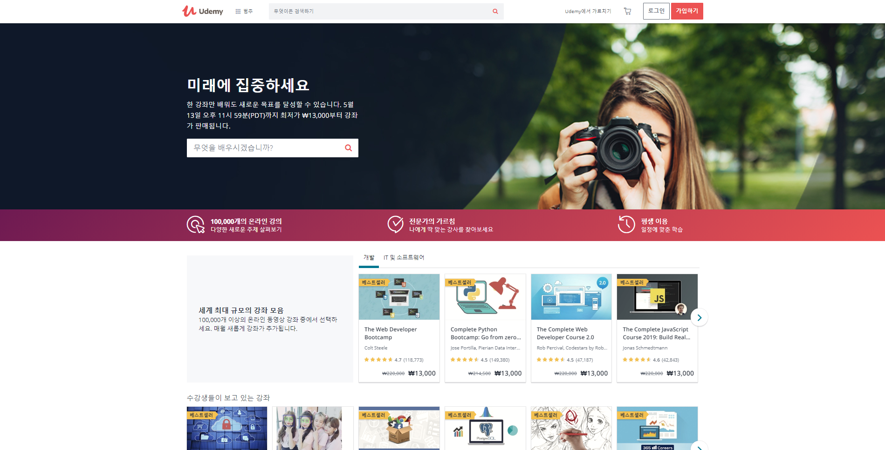

# 참고문헌 선정

### 1. 책(Book)

* 가장 기본적인 참고문헌에는 **책**이있다. 하지만 IT전문서와 활용서는 일반서점에서 팔지 않을수도 있기에 다음과 같은 사이트를 소개하다.

`1.한빛 미디어`

* 브랜드 소개

**“책으로 여는 IT 세상”**

한빛미디어(주)는 ‘책으로 여는 IT 세.상’을 만들어 갑니다. IT 세상의 주역은 ‘우리’ 입니다. 한빛미디어(주)는 IT 세상의 주역들을 위한 프로그래밍, 컴퓨터공학, IT 에세이, Make, 리얼타임(전자책), OA, 그래픽, 나와 내 아이를 위한 실용 등 다양한 분야의 책으로 IT 세상을 만들어 가고 있습니다.

[한빛미디어 홈페이지](http://www.hanbit.co.kr/store/books/bestseller_list.html)

`2.프리렉(freelec)`

* 프리렉은 책을 판매할 뿐만 아니라 유튜브,페이스북,네이버 포스트를 통해 최신 정보를 업데이트하고 강의를 들을수 있게 되어있다.

[프리렉 사이트](https://freelec.co.kr/)

[프리렉 유튜브](https://www.youtube.com/user/FREELECKOR)

[프리렉 페이스북](https://www.facebook.com/%ED%94%84%EB%A6%AC%EB%A0%89-%EC%B6%9C%ED%8C%90%EC%82%AC-freelec-509640889554399/)

[프리렉 네이버포스트](https://post.naver.com/my.nhn?memberNo=34865381)

### 2. 인터넷강의

`1. Udemy`

* Udemy는 100,000개의 다양한 주제의 강의를 가진 **세계 최대의 강좌 모음**입니다. 강사가 올린 강의를 확인하고, 미리보기와 리뷰를 통하여 구매할지 결정할수있습니다.

[Udemy 사이트](https://www.udemy.com/)

### 3. 개발자 커뮤니티 사이트

`1. Stack Overflow`

`2. Quora`

